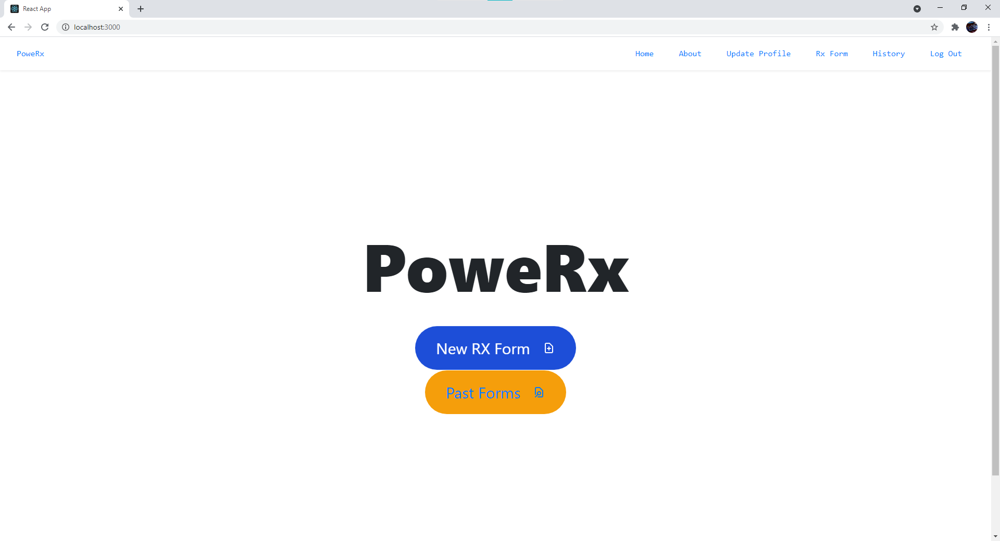
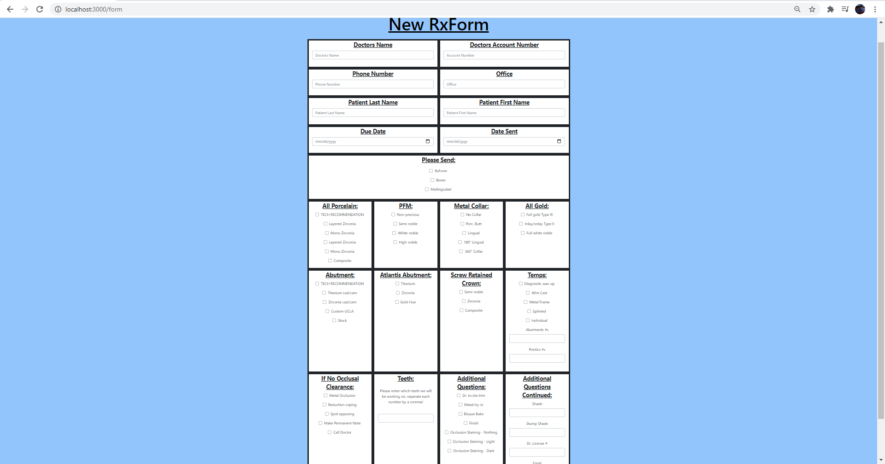
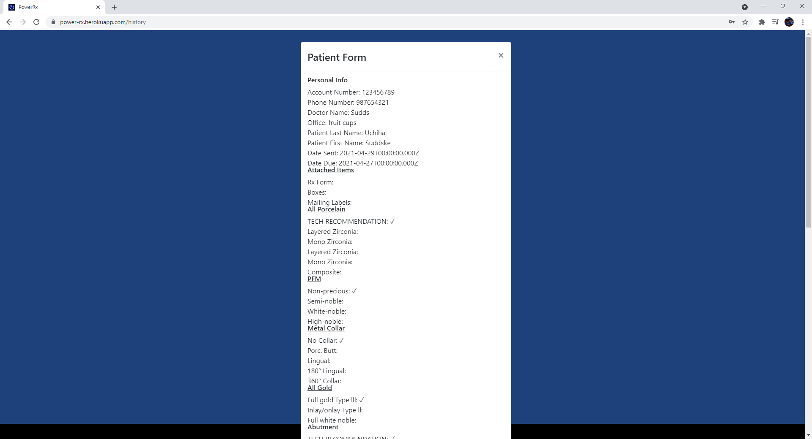
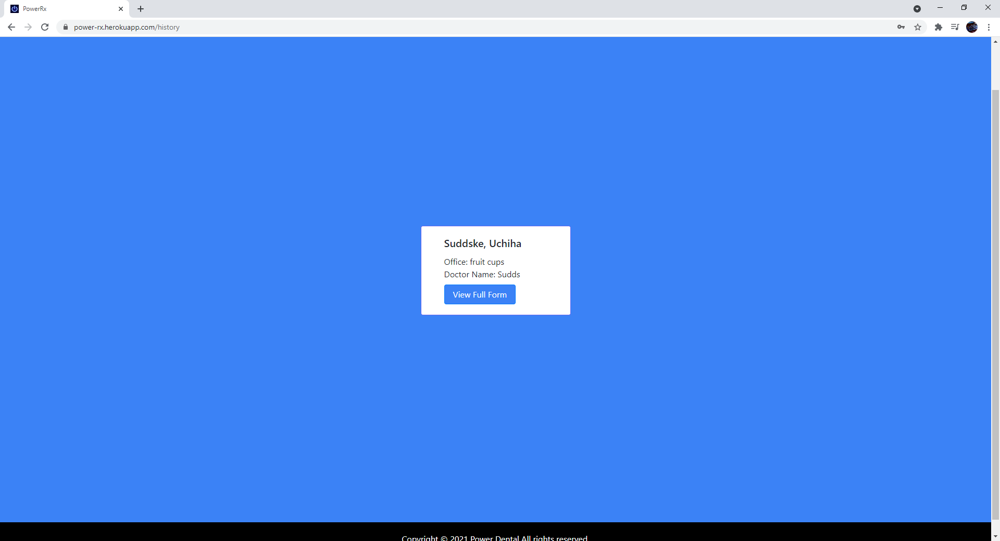

# PoweRx

​
## Description 

This is an application made for Power Dental to provide their customers with an easier way to submit product requests online, instead of having to fill out a form with pen and paper.  Power Dental is an advanced full-service dental laboratory allows us to provide you with the very best cosmetic dentistry, implant dentistry, and aesthetic restorative dentistry care in the Chicagoland area.  The user is able to make an account on this website, create an RX Form, and submit the form to Power Dental.  This form allows the user to select from over fourty different styles of dental molds and also select individual teeth.  Once the form is submitted, Power Dental will be able to access the form and create the order for the customer.  
​

​
## Table of Contents
​
* [Installation](#installation)
* [Screenshots](#screenshots)
* [Tests](#tests)
* [Deployed Site](#deployed-site)
* [Contributing](#contributing)
* [Questions](#questions)
* [License](#license)

​
​

​
## Installation
1) Copy the HTTPS link from repository 
2) Open the folder you wish to add this application to in your code editor. 
3) Open the integrated terminal in the selected folder. 
4) Run git clone and paste HTTPS link from repository. 
5) Run "npm i" to install  the node modules associated with this application.
6) Change user info for your mongodb, and firebase accounts.
7) In the terminal, type in "npm start" to run the application, enjoy!
​

​
​
## Screenshots

​

​
## Tests
[Test of the application](https://drive.google.com/file/d/1CVJdQBwWshNiY5sytBuyJHVhgoAVzaSc/view?usp=sharing)
​

​
## Deployed Site
[Live Site](https://power-rx.herokuapp.com/login)
​

​
## Contributing
Anyone can contribute to this application by forking the repo, adding their code to the application, and then sending any of the contributors a pull request so the main branch can be updated.
​

​
## Questions
​
You can find the GitHub profile by clicking this link: [My GitHub Profile ](https://github.com/sawi4644/PoweRx)
​
-

If you have any questions you can email us at:  [My Email](test@test.com)
​

​
## License Under
​
### MIT License
​
Permission is hereby granted, free of charge, to any person obtaining a copy
of this software and associated documentation files (the "Software"), to deal
in the Software without restriction, including without limitation the rights
to use, copy, modify, merge, publish, distribute, sublicense, and/or sell
copies of the Software, and to permit persons to whom the Software is
furnished to do so, subject to the following conditions:
​
The above copyright notice and this permission notice shall be included in all
copies or substantial portions of the Software.
​
THE SOFTWARE IS PROVIDED "AS IS", WITHOUT WARRANTY OF ANY KIND, EXPRESS OR
IMPLIED, INCLUDING BUT NOT LIMITED TO THE WARRANTIES OF MERCHANTABILITY,
FITNESS FOR A PARTICULAR PURPOSE AND NONINFRINGEMENT. IN NO EVENT SHALL THE
AUTHORS OR COPYRIGHT HOLDERS BE LIABLE FOR ANY CLAIM, DAMAGES OR OTHER
LIABILITY, WHETHER IN AN ACTION OF CONTRACT, TORT OR OTHERWISE, ARISING FROM,
OUT OF OR IN CONNECTION WITH THE SOFTWARE OR THE USE OR OTHER DEALINGS IN THE
SOFTWARE.